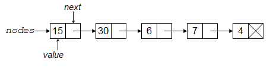

[PDF](./unit2-dataTech.pdf){.btn .btn-primary}

References (see [syllabus](../syllabus) for links):

-   Adler
-   Nolan and Temple Lang, XML and Web Technologies for Data Sciences
    with R.
-   Chambers
-   [R intro manual](http://cran.r-project.org/doc/manuals/R-intro.html)
    on CRAN (R-intro).
-   Venables and Ripley, Modern Applied Statistics with S
-   Murrell, Introduction to Data Technologies.
-   [R Data Import/Export
    manual](http://cran.r-project.org/doc/manuals/R-data.html) on CRAN
    (R-data).
-   SCF tutorial: [Working with large datasets in SQL, R, and Python](https://berkeley-scf.github.io/tutorial-databases/)

(Optional) Videos

There are four videos from 2020 in the bCourses Media Gallery that you
can use for reference if you want to:

1.  Text files and ASCII
2.  Encodings and UTF-8
3.  HTML
4.  XML and JSON

# 1. Data storage and file formats on a computer

We're going to start early in the data analysis pipeline: getting data,
reading data in, writing data out to disk, and webscraping. We'll focus
on doing these manipulations in R, but the concepts and tools involved
are common to other languages, so familarity with these in R should
allow you to pick up other tools easily. The main downside to
working with datasets in R (true for Python and most other languages as well) is that the entire
dataset resides in memory, so R is not so good for dealing with very
large datasets. More on alternatives in a later unit. R (and similar
languages) has the capability to read in a wide variety of file formats.

## Text and binary files

In general, files can be divided into text files and binary files. In
both cases, information is stored as a series of bits. Recall that a bit
is a single value in base 2 (i.e., a 0 or a 1), while a byte is 8 bits.

A **text file** is one in which the bits in the file encode individual
characters. Note that the characters can include the digit characters
0-9, so one can include numbers in a text file by writing down the
digits needed for the number of interest. Examples of text file formats
include CSV, XML, HTML, and JSON.

Text files may be simple ASCII files (i.e., files encoded using ASCII)
or in other encodings such as UTF-8, both covered in Section 5.
[ASCII](http://en.wikipedia.org/wiki/ASCII) files have 8 bits (1 byte)
per character and can represent 128 characters (the 52 lower and upper
case letters in English, 10 digits, punctuation and a few other things
-- basically what you see on a standard US keyboard). UTF-8 files have
between 1 and 4 bytes per character.

A **binary file** is one in which the bits in the file encode the
information in a custom format and not simply individual characters.
Binary formats are not (easily) human readable but can be more
space-efficient and faster to work with (because it can allow random
access into the data rather than requiring sequential reading). The
meaning of the bytes in such files depends on the specific binary format
being used and a program that uses the file needs to know how the format
represents information. Examples of binary files include netCDF files, R
data (e.g., .Rda) files, Python pickle files, and compiled code files.

Numbers in binary files are usually stored as 8 bytes per number. We'll
discuss this much more in Unit 8.

## Common file types

Here are some of the common file types, some of which are text formats and some of which are binary formats.

1.  'Flat' text files: data are often provided as simple text files.
    Often one has one record or observation per row and each column or
    field is a different variable or type of information about the
    record. Such files can either have a fixed number of characters in
    each field (*fixed width format*) or a special character (a *delimiter*)
    that separates the fields in each row. Common delimiters are tabs,
    commas, one or more spaces, and the pipe (\|). Common file
    extensions are *.txt* and *.csv*. Metadata (information about the
    data) are often stored in a separate file. CSV files are quite
    common, but if you have files where the data contain commas, other
    delimiters can be good. Text can be put in quotes in CSV files, and
    this can allow use of commas within the data. This is difficult to
    deal with from the command line, but *read.table()* in R handles this situation.

    -   One occasionally tricky difficulty is as follows. If you have a
        text file created in Windows, the line endings are coded
        differently than in UNIX. Windows uses a newline
        (the ASCII character `\n`)
        and a carriage return (the ASCII character `\r`) whereas
        UNIX uses onlyl a  newline in UNIX). There are
        UNIX utilities (`fromdos` in
        Ubuntu, including the SCF Linux machines and `dos2unix` in other
        Linux distributions) that can do the necessary conversion. If
        you see *\^M* at the end of the lines in a file, that's the tool
        you need. Alternatively, if you open a UNIX file in Windows, it
        may treat all the lines as a single line. You can fix this with
        `todos` or `unix2dos`.

2.  In some contexts, such as textual data and bioinformatics data, the
    data may be in a text file with one piece of information per row, but
    without meaningful columns/fields.

3.  In scientific contexts, netCDF (*.nc*) (and the related HDF5) are
    popular format for gridded data that allows for highly-efficient
    storage and contains the metadata within the file. The basic
    structure of a netCDF file is that each variable is an array with
    multiple dimensions (e.g., latitude, longitude, and time), and one
    can also extract the values of and metadata about each dimension.
    The *ncdf4* package in R nicely handles working with netCDF files.

4.  Data may also be in text files in formats designed for data
    interchange between various languages, in particular XML or JSON.
    These formats are "self-describing"; namely the metadata is part of
    the file. The *XML2, rvest*, and *jsonlite* packages are useful for
    reading and writing from these formats. More in Section 4.

5.  You may be scraping information on the web, so dealing with text
    files in various formats, including HTML. The *XML2* and *rvest*
    packages are also useful for reading HTML.

6.  Data may already be in a database or in the data storage format of another
    statistical package (*Stata*, *SAS*, *SPSS*, etc.). The *foreign*
    package in R has excellent capabilities for importing Stata
    (*read.dta()*), SPSS (*read.spss()*), and SAS (*read.ssd()* and, for
    XPORT files, *read.xport()*), among others.

7.  For Excel, there are capabilities to read an Excel file (see the
    *readxl* and *XLConnect* package among others), but you can also
    just go into Excel and export as a CSV file or the like and then
    read that into R. In general, it's best not to pass around data
    files as Excel or other spreadsheet format files because (1) Excel
    is proprietary, so someone may not have Excel and the format is
    subject to change, (2) Excel imposes limits on the number of
    rows, (3) one can easily manipulate text files such as CSV using
    UNIX tools, but this is not possible with an Excel file, (4) Excel
    files often have more than one sheet, graphs, macros, etc., so
    they're not a data storage format per se.

8.  R can easily interact with databases (SQLite, PostgreSQL, MySQL,
    Oracle, etc.), querying the database using SQL and returning results
    to R. More in the big data unit and in the large datasets tutorial
    mentioned above.

# 2. Reading data from text files into R

## Core R functions

*read.table()* is probably the most commonly-used function for reading
in data. It reads in delimited files (*read.csv()* and *read.delim()*
are special cases of *read.table()*). The key arguments are the
delimiter (the *sep* argument) and whether the file contains a header, a
line with the variable names. We can use *read.fwf()* to read from a
fixed width text file into a data frame.

The most difficult part of reading in such files can be dealing with how
R determines the classes of the fields that are read in. There are a
number of arguments to *read.table()* and *read.fwf()* that allow the
user to control the classes. One difficulty in older versions of R was
that character fields were read in as factors.

Let's work through a couple examples. Before we do that, let's look at
the arguments to *read.table()*. Note that `sep=''` separates on any
amount of white space. 

```{r, readcsv, eval = TRUE}
dat <- read.table(file.path('..', 'data', 'RTADataSub.csv'),
                  sep = ',', header = TRUE)
sapply(dat, class)[1:10]  # What are the classes of the columns?
## whoops, there is an 'x', presumably indicating missingness:
unique(dat[ , 2])
## let's treat 'x' as a missing value indicator
dat2 <- read.table(file.path('..', 'data', 'RTADataSub.csv'),
                   sep = ',', header = TRUE,
                   na.strings = c("NA", "x"))
unique(dat2[ , 2])
## Let's check that the empty strings from 'dat' are now NAs in 'dat2'
which(dat[ , 2] == "")[1:10]
dat2[which(dat[, 2] == "")[1], ] # pull out a line with a missing string
```

Using `colClasses` is a good way to control how data are read in.

```{r, colClasses}
sequ <- read.table(file.path('..', 'data', 'hivSequ.csv'),
  sep = ',', header = TRUE,
  colClasses = c('integer','integer','character',
    'character','numeric','integer'))
## let's make sure the coercion worked - sometimes R is obstinant
sapply(sequ, class)
## that made use of the fact that a data frame is a list
```

Note that you can avoid reading in one or more columns by specifying
*NULL* as the column class for those columns to be omitted. Also,
specifying the *colClasses* argument explicitly should make for faster
file reading. Finally, setting `stringsAsFactors=FALSE` is standard
practice and is the default in R as of version 4.0. (*readr::read_csv()*
has always set `stringsAsFactors=FALSE`).

If possible, it's a good idea to look through the input file in the
shell or in an editor before reading into R to catch such issues in
advance. Using the UNIX command *less* on *RTADataSub.csv* would have revealed these
various issues, but note that *RTADataSub.csv* is a 1000-line subset of
a much larger file of data available from the kaggle.com website. So
more sophisticated use of UNIX utilities (as we will see in Unit 3) is often
useful before trying to read something into a program.

The basic function *scan()* simply reads everything in, ignoring lines,
which works well and very quickly if you are reading in a numeric vector
or matrix. *scan()* is also useful if your file is free format - i.e.,
if it's not one line per observation, but just all the data one value
after another; in this case you can use *scan()* to read it in and then
format the resulting character or numeric vector as a matrix with as
many columns as fields in the dataset. Remember that the default is to
fill the matrix by column.

If the file is not nicely arranged by field (e.g., if it has ragged
lines), we'll need to do some more work. *readLines()* will read in each
line into a separate character vector, after which we can process the
lines using text manipulation. Here's an example from some US
meteorological data where I know from metadata (not provided here) that
the 4-11th values are an identifier, the 17-20th are the year, the
22-23rd the month, etc.

```{r, readLines}
dat <- readLines(file.path('..', 'data', 'precip.txt'))
id <- as.factor(substring(dat, 4, 11) )
year <- substring(dat, 18, 21)
year[1:5]
class(year)
year <- as.integer(substring(dat, 18, 21))
month <- as.integer(substring(dat, 22, 23))
nvalues <- as.integer(substring(dat, 28, 30))
```


Actually, that file, *precip.txt*, is in a fixed-width format (i.e.,
every element in a given column has the exact same number of
characters),so reading in using *read.fwf()* would be a good strategy.

## Connections

R allows you to read in not just from a file but from a more general
construct called a *connection*. This can include reading in text from the output of running a shell command and from unzipping a file on the fly.

Here are some examples of connections:

```{r, connections, eval=FALSE}
dat <- readLines(pipe("ls -al"))
dat <- read.table(pipe("unzip dat.zip"))
dat <- read.csv(gzfile("dat.csv.gz"))
dat <- readLines("http://www.stat.berkeley.edu/~paciorek/index.html")
```


In some cases, you might need to create the connection using *url()* or
using the *curl()* function from the *curl* package. Though for the
example here, simply passing the URL to *readLines()* does work. (In
general, *curl::curl()* provides some nice features for reading off the
internet.)

```{r, curl}
wikip1 <- readLines("https://wikipedia.org")
wikip2 <- readLines(url("https://wikipedia.org"))
library(curl)
wikip3 <- readLines(curl("https://wikipedia.org"))
```

If a file is large, we may want to read it in in chunks (of lines), do
some computations to reduce the size of things, and iterate. This is referred
to as online processing.
*read.table()*, *read.fwf()* and *readLines()* all have the arguments
that let you read in a fixed number of lines. To read-on-the-fly in
blocks, we need to first establish the connection and then read from it
sequentially. (If you don't, you'll read from the start of the file
every time you read from the file.)

```{r, streaming, eval=FALSE}
con <- file(file.path("..", "data", "precip.txt"), "r")
## "r" for 'read' - you can also open files for writing with "w"
## (or "a" for appending)
class(con)
blockSize <- 1000 # obviously this would be large in any real application
nLines <- 300000
for(i in 1:ceiling(nLines / blockSize)){
    lines <- readLines(con, n = blockSize)
    # manipulate the lines and store the key stuff
}
close(con)
```
 


Here's an example of using *curl()* to do this for a file on the web.

```{r, stream-curl, cache=TRUE}
URL <- "https://www.stat.berkeley.edu/share/paciorek/2008.csv.gz"
con <- gzcon(curl(URL, open = "r"))
## url() in place of curl() works too
for(i in 1:4) {   ## Read in first four chunks as an example
	print(i)
	print(system.time(tmp <- readLines(con, n = 100000)))
	print(tmp[1])
}
close(con)
```

More details on sequential (on-line) processing of large files can be
found in the tutorial on large datasets mentioned in the reference list
above.

One cool trick that can come in handy is to create a *text connection*.
This lets you 'read' from an R character vector as if it were a text
file and could be handy for processing text. For example, you could then
use *read.fwf()* applied to *con*.

```{r, text-connection}
dat <- readLines('../data/precip.txt')
con <- textConnection(dat[1], "r")
read.fwf(con, c(3,8,4,2,4,2))
```


We can create connections for writing output too. Just make sure to open
the connection first.

## File paths

A few notes on file paths, related to ideas of reproducibility.

1.  In general, you don't want to hard-code absolute paths into your
    code files because those absolute paths won't be available on the
    machines of anyone you share the code with. Instead, use paths
    relative to the directory the code file is in, or relative to a
    baseline directory for the project, e.g.:\
    
    ```{r, relative-paths, eval=FALSE}
    dat <- read.csv('../data/cpds.csv')
    ```    

2.  Be careful with the directory separator in Windows files: you can
    either do `C:\\mydir\\file.txt` or `C:/mydir/file.txt`, but
    not `C:\mydir\file.txt`, and note the next comment about
    avoiding use of '\\' for portability.

3.  Using UNIX style directory separators will work in Windows, Mac or
    Linux, but using Windows style separators is not portable across
    operating systems.\

    ```{r, path-separators, eval=FALSE}

    ## good: will work on Windows
    dat <- read.csv('../data/cpds.csv')
    ## bad: won't work on Mac or Linux
    dat <- read.csv('..\\data\\cpds.csv')  
    ```

4.  Even better, use *file.path()* so that paths are constructed
    specifically for the operating system the user is using:\

    ```{r, file.path, eval=FALSE}

    ## good: operating-system independent
    dat <- read.csv(file.path('..', 'data', 'cpds.csv'))  
    ```

## The *readr* package

*readr* is intended to deal with some of the shortcomings of the base R
functions, such as leaving column names unmodified, and recognizing
dates/times. It reads data in much more quickly than the base R
equivalents. See [this blog
post](http://blog.rstudio.org/2015/04/09/readr-0-1-0/). Some of the
readr functions that are analogs to the comparably-named base R
functions are *read_csv()*, *read_fwf()*, *read_lines()*, and
*read_table()*.

Let's try out *read_csv()* on the airline dataset used in the R
bootcamp.

```{r, readr}
library(readr)
## I'm violating the rule about absolute paths here!!
## (airline.csv is big enough that I don't want to put it in the
##    course repository)
dir <- "~/staff/workshops/r-bootcamp-fall-2020/data"
system.time(dat <- read.csv(file.path(dir, 'airline.csv'), stringsAsFactors = FALSE)) 
system.time(dat2 <- read_csv(file.path(dir, 'airline.csv')))
```


## Reading data quickly

In addition to the tips above, there are a number of packages that allow
one to read large data files quickly, in particular *data.table*, *arrow*,
and *fst*. In general, these provide the ability to load datasets
into R without having them in memory, but rather stored in clever ways
on disk that allow for fast access. Metadata is stored in R. More on
this in the unit on big data and in the tutorial on large datasets
mentioned in the reference list above.

# 3. Output from R

## Writing output to files

Functions for text output are generally analogous to those for input.
*write.table()*, *write.csv()*, and *writeLines()* are analogs of
*read.table()*, *read.csv()*, and *readLines()*. *write_csv()* is the
*readr* version of write.csv. *write()* can be used to write a matrix to
a file, specifying the number of columns desired. *cat()* can be used
when you want fine control of the format of what is written out and
allows for outputting to a connection (e.g., a file).

*toJSON()* in the *jsonlite* package will output R objects as JSON. One
use of JSON as output from R would be to *serialize* the information in
an R object such that it could be read into another program.

And of course you can always save to an R data file (a binary file format) using *save.image()*
(to save all the objects in the workspace or *save()* to save only some
objects. Happily this is platform-independent so can be used to transfer
R objects between different OS.

## Formatting output

*cat()* is a good choice for printing a message to the screen, often
better than *print()*, which is an object-oriented method. You generally
won't have control over how the output of a *print()* statement is
actually printed.

```{r, print}
val <- 1.5
cat('My value is ', val, '.\n', sep = '')
print(paste('My value is ', val, '.', sep = ''))
```


We can do more to control formatting with *cat()*:

```{r, cat}

## input
x <- 7
n <- 5
## display powers
cat("Powers of", x, "\n")
cat("exponent   result\n\n")
result <- 1
for (i in 1:n) {
    result <- result * x
    cat(format(i, width = 8), format(result, width = 10),
            "\n", sep = "")
}
```


One thing to be aware of when writing out numerical data is how many
digits are included. For example, the default with `write` and
`cat` is the number of digits that R displays to the screen,
controlled by `options()$digits`. But note that `options()$digits` seems
to have some variability in behavior across operating systems. If you
want finer control, use `sprintf`. For example, here we print out
temperatures as reals ("f"=floating point) with four decimal places
and nine total character positions, followed by a C for Celsius:

```{r, sprintf}
temps <- c(12.5, 37.234324, 1342434324.79997234, 2.3456e-6, 1e10)
sprintf("%9.4f C", temps)
city <- "Boston"
sprintf("The temperature in %s was %.4f C.", city, temps[1])
sprintf("The temperature in %s was %9.4f C.", city, temps[1])
```

To change the number of digits printed to the screen,
do `options(digits = 5)` or specify as an argument to `print` or
use `sprintf`.

# 4. Webscraping and working with HTML, XML, and JSON

The book *XML and Web Technologies for Data Sciences with R* by Deb
Nolan (UCB Stats faculty) and Duncan Temple Lang (UCB Stats PhD alumnus
and UC Davis Stats faculty) provides extensive information about getting
and processing data off of the web, including interacting with web
services such as REST and SOAP and programmatically handling
authentication.

Here are some UNIX command-line tools to help in webscraping and working
with files in formats such as JSON, XML, and HTML:
<http://jeroenjanssens.com/2013/09/19/seven-command-line-tools-for-data-science.html>.

We'll cover a few basic examples in this section, but HTML and XML
formatting and navigating the structure of such pages in great detail is
beyond the scope of what we can cover. The key thing is to see the main
concepts and know that the tools exist so that you can learn how to use
them if faced with such formats.

## Reading HTML

HTML (Hypertext Markup Language) is the standard markup language used
for displaying content in a web browser. In simple webpages (ignoring
the more complicated pages that involve Javascript), what you see in
your browser is simply a *rendering* (by the browser) of a text file containing HTML.

However, instead of rendering the HTML in a browser, we might want to
use code to extract information from the HTML.

Let's see a brief example of reading in HTML tables.

Note that before doing any coding, it can be helpful to look at the raw
HTML source code for a given page. We can explore the underlying HTML
source in advance of writing our code by looking at the page source
directly in the browser (e.g., in Firefox under the 3-lines "open menu"
symbol, see `Web Developer (or More Tools) -> Page Source` and in Chrome
`View -> Developer -> View Source`), or by downloading the webpage and
looking at it in an editor, although in some cases (such as the
nytimes.com case), what we might see is a lot of JavaScript.

One lesson here is not to write a lot of your own code to do something
that someone else has probably already written a package for. We'll use
the *rvest* package.

```{r, https}
library(rvest, quietly = TRUE)  # uses xml2
URL <- "https://en.wikipedia.org/wiki/List_of_countries_and_dependencies_by_population"
html <- read_html(URL)
tbls <- html_table(html_elements(html, "table"))
sapply(tbls, nrow)
pop <- tbls[[1]]
head(pop)
```

(Caution here -- notice what format the columns are stored in...)

*read_html()* works by reading in the HTML as text and then parsing it
to build up a tree containing the HTML elements. Then *html_elements()*
finds the HTML tables and *html_table()* converts them to data frames.
rvest is part of the tidyverse, so it's often used with piping, e.g.,

```{r, https-pipe}
## Turns out that html_table can take the entire html doc as input
tbls <- URL |> read_html() |> html_table()
```

It's often useful to be able to extract the hyperlinks in an HTML
document. We'll find the link using [CSS
selectors](https://www.w3schools.com/cssref/css_selectors.asp), which
allow you to search for elements within HTML:

```{r, htmlLinks}

URL <- "http://www1.ncdc.noaa.gov/pub/data/ghcn/daily/by_year"
## approach 1: search for elements with 'href' attribute
links <- read_html(URL) %>% html_elements("[href]") %>% html_attr('href')
## approach 2: search for HTML 'a' tags
links <- read_html(URL) %>% html_elements("a") %>% html_attr('href')
head(links, n = 10)
```

More generally, we may want to read an HTML document, parse it into its
components (i.e., the HTML elements), and navigate through the tree
structure of the HTML. Here we use the *XPath* language to specify
elements rather than CSS selectors. XPath can also be used for
navigating through XML documents.

```{r, XPath}
## find all 'a' elements that have attribute 'href'; then
## extract the 'href' attribute
links <- read_html(URL) %>% html_elements(xpath = "//a[@href]") %>%
    html_attr('href')
head(links)

## we can extract various information
listOfANodes <- read_html(URL) %>% html_elements(xpath = "//a[@href]")
listOfANodes %>% html_attr('href') %>% head(n = 10)
listOfANodes %>% html_name() %>% head(n = 10)
listOfANodes %>% html_text()  %>% head(n = 10)
```

Here's another example of extracting specific components of information
from a webpage (results not shown, since headlines will vary from day to
day).

```{r, XPath2, eval=FALSE}
URL <- "https://www.nytimes.com"
headlines2 <- read_html(URL) %>% html_elements("h2") %>% html_text()
head(headlines2)
headlines3 <- read_html(URL) %>% html_elements("h3") %>% html_text()
head(headlines3)
```

## XML

XML is a markup language used to store data in self-describing (no
metadata needed) format, often with a hierarchical structure. It
consists of sets of elements (also known as nodes because they generally
occur in a hierarchical structure and therefore have parents, children,
etc.) with tags that identify/name the elements, with some similarity to
HTML. Some examples of the use of XML include serving as the underlying
format for Microsoft Office and Google Docs documents and for the KML
language used for spatial information in Google Earth.

Here's a brief example. The book with id attribute *bk101* is an
element; the author of the book is also an element that is a child
element of the book. The id attribute allows us to uniquely identify the
element.

```
    <?xml version="1.0"?>
    <catalog>
       <book id="bk101">
          <author>Gambardella, Matthew</author>
          <title>XML Developer's Guide</title>
          <genre>Computer</genre>
          <price>44.95</price>
          <publish_date>2000-10-01</publish_date>
          <description>An in-depth look at creating applications with XML.</description>
       </book>
       <book id="bk102">
          <author>Ralls, Kim</author>
          <title>Midnight Rain</title>
          <genre>Fantasy</genre>
          <price>5.95</price>
          <publish_date>2000-12-16</publish_date>
         <description>A former architect battles corporate zombies, an evil sorceress, and her own childhood to become queen of the world.</description>
       </book>
    </catalog>
```

We can read XML documents into R using `xml2::read_xml()` and then
manipulate it using other functions from the *xml2* package. Here's an
example of working with lending data from the Kiva lending non-profit.
You can see the XML format in a browser at

<http://api.kivaws.org/v1/loans/newest.xml>.

XML documents have a tree structure with information at nodes. As above
with HTML, one can use the *XPath* language for navigating the tree and
finding and extracting information from the node(s) of interest.

Here is some example code for extracting loan info from the Kiva data.
We'll first show the 'brute force' approach of working with the data as a
list and then the better approach of using XPath.

```{r, xml}
library(xml2)
doc <- read_xml("https://api.kivaws.org/v1/loans/newest.xml")
data <- as_list(doc)
names(data)
names(data$response)
length(data$response$loans)
data$response$loans[[2]][c('name', 'activity',
                           'sector', 'location', 'loan_amount')]

## alternatively, extract only the 'loans' info (and use pipes)
loansNode <- doc %>% html_elements('loans')
loanInfo <- loansNode %>% xml_children() %>% as_list()
length(loanInfo)
names(loanInfo[[1]])
names(loanInfo[[1]]$location)

## suppose we only want the country locations of the loans (using XPath)
xml_find_all(loansNode, '//location//country')
xml_find_all(loansNode, '//location//country') %>% xml_text()

## or extract the geographic coordinates
xml_find_all(loansNode, '//location//geo/pairs')
```

## JSON

JSON files are structured as "attribute-value" pairs (aka "key-value"
pairs), often with a hierarchical structure. Here's a brief example:

```
    {
      "firstName": "John",
      "lastName": "Smith",
      "isAlive": true,
      "age": 25,
      "address": {
        "streetAddress": "21 2nd Street",
        "city": "New York",
        "state": "NY",
        "postalCode": "10021-3100"
      },
      "phoneNumbers": [
        {
          "type": "home",
          "number": "212 555-1234"
        },
        {
          "type": "office",
          "number": "646 555-4567"
        }
      ],
      "children": [],
      "spouse": null
    }
```

A set of key-value pairs is a named array and is placed inside braces
(squiggly brackets). Note the nestedness of arrays within arrays (e.g.,
address within the overarching person array and the use of square
brackets for unnamed arrays (i.e., vectors of information), as well as
the use of different types: character strings, numbers, null, and (not
shown) boolean/logical values. JSON and XML can be used in similar ways,
but JSON is less *verbose* than XML.

We can read JSON into R using *fromJSON()* in the *jsonlite* package.
Let's play again with the Kiva data. The same data that we had worked
with in XML format is also available in JSON format:
<http://api.kivaws.org/v1/loans/newest.json>.

```{r, json}
library(jsonlite)
data <- fromJSON("http://api.kivaws.org/v1/loans/newest.json")
class(data)
names(data)
class(data$loans) # nice!
head(data$loans)

data$loans[1, 'location.geo.pairs'] # hmmm...
data$loans[1, 'location']
```

One disadvantage of JSON is that it is not set up to deal with missing
values, infinity, etc.

## Webscraping and web APIs

Here we'll see some examples of making requests over the Web to get
data. We'll use APIs to systematically query a website for information.
Ideally, but not always, the API will be documented. In many cases that
simply amounts to making an HTTP GET request, which is done by
constructing a URL.

The packages *RCurl* and *httr* are useful for a wide variety of such
functionality. Note that much of the functionality I describe below is
also possible within the shell using either *wget* or *curl*.

### Webscraping ethics and best practices

Webscraping is the process of extracting data from the web, either
directly from a website or using a web API (application programming
interface).

1.  **Should you webscrape?** In general, if we can avoid webscraping
    (particularly if there is not an API) and instead directly download
    a data file from a website, that is greatly preferred.

2.  **May you webscrape?** Before you set up any automated downloading
    of materials/data from the web you should make sure that what you
    are about to do is consistent with the rules provided by the
    website.

Some places to look for information on what the website allows are:

-   legal pages such as Terms of Service or Terms and Conditions on the
    website.

-   check the robots.txt file (e.g.,
    <https://scholar.google.com/robots.txt>) to see what a web crawler
    is allowed to do, and whether the site requires a particular delay
    between requests to the sites

-   potentially contact the site owner if you plan to scrape a large
    amount of data

Here are some links with useful information:

-   [A blog post overview on webscraping and
    robots.txt](http://feedproxy.google.com/~r/RBloggers/~3/RZGJ8Trv5Xw/?utm_source=feedburner&utm_medium=email)

-   [Blog post on webscraping
    ethics](https://towardsdatascience.com/ethics-in-web-scraping-b96b18136f01)

-   [Some information on how to understand a robots.txt
    file](https://www.promptcloud.com/blog/how-to-read-and-respect-robots-file)

Tips for when you make automated requests:

- When debugging code that processes the result of such a request, just run the request once, save (i.e., cache) the result, and then work on the processing code applied to the result. Don't make the same request over and over again.
- In many cases you will want to include a time delay between your
automated requests to a site, including if you are not actually crawling
a site but just want to automate a small number of queries.

### What is HTTP?

HTTP (hypertext transfer protocol) is a system for communicating
information from a server (i.e., the website of interest) to a client
(e.g., your laptop). The client sends a request and the server sends a
response.

When you go to a website in a browser, your browser makes an HTTP GET
request to the website. Similarly, when we did some downloading of html
from webpages above, we used an HTTP GET request.

Anytime the URL you enter includes parameter information after a question mark
(`www.somewebsite.com?param1=arg1&param2=arg2`), you are using an API.

The response to an HTTP request will include a status code, which can be
interpreted based on [this
information](https://developer.mozilla.org/en-US/docs/Web/HTTP/Status).

The response will generally contain content in the form of text (e.g.,
HTML, XML, JSON) or raw bytes.

### APIs: REST- and SOAP-based web services

Ideally a web service documents their API (Applications Programming
Interface) that serves data or allows other interactions. REST and SOAP
are popular API standards/styles. Both REST and SOAP use HTTP requests;
we'll focus on REST as it is more common and simpler. When using REST, we access *resources*, which might be a Facebook
account or a database of stock quotes. The API will
(hopefully) document what information it expects from the user and will
return the result in a standard format (often a particular file format
rather than producing a webpage).

Often the format of the request is a URL (aka an endpoint) plus a query
string, passed as a GET request. Let's search for plumbers near
Berkeley, and we'll see the GET request, in the form:

<https://www.yelp.com/search?find_desc=plumbers&find_loc=Berkeley+CA&ns=1>

-   the query string begins with ?

-   there are one or more `Parameter=Argument` pairs

-   pairs are separated by &

-   \+ is used in place of each space


Let's see an example of accessing economic data from the
World Bank, using the [documentation for their API](https://datahelpdesk.worldbank.org/knowledgebase/topics/125589-developer-information). Following the [API call structure](https://datahelpdesk.worldbank.org/knowledgebase/articles/898581-api-basic-call-structures), we can download (for example), data on various countries. The documentation indicates that our REST-based query can use either a URL structure or an argument-based structure.

```{r, REST, eval=TRUE}
## Queries based on the documentation
api_url <- "http://api.worldbank.org/V2/incomeLevel/LIC/country"
api_args <- "http://api.worldbank.org/V2/country?incomeLevel=LIC"

## Generalizing a bit
req <- "http://api.worldbank.org/V2/country?incomeLevel=MIC&format=json"
data <- fromJSON(req)
## Be careful of data truncation/pagination
req <- "http://api.worldbank.org/V2/country?incomeLevel=MIC&format=json&per_page=1000"
data <- fromJSON(req)

## Programmatic control
baseURL <- "http://api.worldbank.org/V2/country"
group <- 'MIC'
format <- 'json'
args <- c(incomeLevel = group, format = format, per_page = 1000)
url <- paste0(baseURL, "?",
    paste(  paste(names(args), args, sep = "="),  collapse = "&"))
   
data <- fromJSON(url)
class(data)
length(data)
names(data)
head(data[[2]])
```

APIs can change and disappear. Last year the example above involved the World Bank's Climate Data API, which I can no longer find!


As another example, here we can see the [US Treasury Department API](https://fiscaldata.treasury.gov/api-documentation/), which allows us to construct queries for federal financial data.

The Nolan and Temple Lang book provides a number of examples of
different ways of authenticating with web services that control access
to the service.

Finally, some web services allow us to pass information to the service
in addition to just getting data or information. E.g., you can
programmatically interact with your Facebook, Dropbox, and Google Drive
accounts using REST based on HTTP POST, PUT, and DELETE requests.
Authentication is of course important in these contexts and some times
you would first authenticate with your login and password and receive a
"token". This token would then be used in subsequent interactions in the
same session.

I created your *github.berkeley.edu* accounts from Python by interacting
with the [GitHub API](https://docs.github.com/en/rest/reference/repos)
using the *requests* package.

### HTTP requests by deconstructing an (undocumented) API

In some cases an API may not be documented or we might be lazy and not
use the documentation. Instead we might deconstruct the queries a
browser makes and then mimic that behavior, in some cases having to
parse HTML output to get at data. Note that if the webpage changes even
a little bit, our carefully constructed query syntax may fail.

Let's look at some UN data (agricultural crop data). By going to\
<http://data.un.org/Explorer.aspx?d=FAO>, and clicking on "Crops", we'll
see a bunch of agricultural products with "View data" links. Click on
"apricots" as an example and you'll see a "Download" button that allows
you to download a CSV of the data. Let's select a range of years and
then try to download "by hand". Sometimes we can right-click on the link
that will download the data and directly see the URL that is being
accessed and then one can deconstruct it so that you can create URLs
programmatically to download the data you want.

In this case, we can't see the full URL that is being used because
there's some Javascript involved. Therefore, rather than looking at the
URL associated with a link we need to view the actual HTTP request sent
by our browser to the server. We can do this using features of the
browser (e.g., in Firefox see `Web Developer -> Network` and in Chrome
`View -> Developer -> Developer tools` and choose the `Network` tab) (or right-click on the
webpage and select `Inspect` and then `Network`). Based on this we can
see that an HTTP GET request is being used with a URL such as:\
<http://data.un.org/Handlers/DownloadHandler.ashx?DataFilter=itemCode:526;year:2012,2013,2014,2015,2016,2017&DataMartId=FAO&Format=csv&c=2,4,5,6,7&s=countryName:asc,elementCode:asc,year:desc>.

We'e now able to easily download the data using that URL, which we can
fairly easily construct using string processing in bash, R, or Python,
such as this (here I just paste it together directly, but using more structured syntax
such as I used for the World Bank example would be better):

```{r, http-byURL}

## example URL:
## http://data.un.org/Handlers/DownloadHandler.ashx?DataFilter=itemCode:526;
##year:2012,2013,2014,2015,2016,2017&DataMartId=FAO&Format=csv&c=2,4,5,6,7&
##s=countryName:asc,elementCode:asc,year:desc
itemCode <- 526
baseURL <- "http://data.un.org/Handlers/DownloadHandler.ashx"
yrs <- paste(as.character(2012:2017), collapse = ",")
filter <- paste0("?DataFilter=itemCode:", itemCode, ";year:", yrs)
args1 <- "&DataMartId=FAO&Format=csv&c=2,3,4,5,6,7&"
args2 <- "s=countryName:asc,elementCode:asc,year:desc"
url <- paste0(baseURL, filter, args1, args2)
## if the website provided a CSV we could just do this:
## apricots <- read.csv(url)
## but it zips the file
temp <- tempfile()  ## give name for a temporary file
download.file(url, temp)
dat <- read.csv(unzip(temp))  ## using a connection (see Section 2)

head(dat)
```

So, what have we achieved?

1. We have a reproducible workflow we can share with others (perhaps ourself in the future).

2. We can automate the process of downloading many such files.


### More details on HTTP requests

A more sophisticated way to do the download is to pass the request in a structured way with named input parameters. This request is easier to construct programmatically. Here what is returned is a zip file, which is represented in R as a sequence of “raw” bytes. We can use httr's GET(), followed by writing to disk and reading back in, as follows (for some reason knitr won't print the output...):

```{r, http-get2}
library(httr)
output2 <- GET(baseURL, query = list(
               DataFilter = paste0("itemCode:", itemCode, ";year:", yrs),
               DataMartID = "FAO", Format = "csv", c = "2,3,4,5,6,7",
               s = "countryName:asc,elementCode:asc,year:desc"))
temp <- tempfile()  ## give name for a temporary file
writeBin(content(output2, 'raw'), temp)  ## write out as zip file
dat <- read.csv(unzip(temp))
head(dat)
```

In some cases we may need to send a lot of information as part of the
URL in a GET request. If it gets to be too long (e.g,, more than 2048
characters) many web servers will reject the request. Instead we may
need to use an HTTP POST request (POST requests are often used for
submitting web forms). A typical request would have syntax like this
search (using *RCurl*):

```{r, http-post, eval=FALSE}
if(url.exists('http://www.wormbase.org/db/searches/advanced/dumper')) {
      x = postForm('http://www.wormbase.org/db/searches/advanced/dumper',
              species="briggsae",
              list="",
              flank3="0",
              flank5="0",
              feature="Gene Models",
              dump = "Plain TEXT",
              orientation = "Relative to feature",
              relative = "Chromsome",
              DNA ="flanking sequences only",
              .cgifields = paste(c("feature", "orientation", "DNA",
                                   "dump","relative"), collapse=", "))
}
```

Unfortunately that specific search doesn't work because the server URL
and/or API seem to have changed. But it gives you an idea of what the
format would look like.

*httr* and *RCurl* can handle other kinds of HTTP requests such as PUT
and DELETE. Finally, some websites use cookies to keep track of users
and you may need to download a cookie in the first interaction with the
HTTP server and then send that cookie with later interactions. More
details are available in the Nolan and Temple Lang book.

### Packaged access to an API

For popular websites/data sources, a developer may have packaged up the
API calls in a user-friendly fashion for use from R, Python or other
software. For example there are Python (twitter) and R (twitteR)
packages for interfacing with Twitter via its API.

Here's some example code for Python (the Python package seems to be more
fully-featured than the R package). This looks up the US senators'
Twitter names and then downloads a portion of each of their timelines,
i.e., the time series of their tweets. Note that Twitter has limits on
how much one can download at once.

```{python, twitter-python, engine='python', eval=FALSE}
import json
import twitter

# You will need to set the following variables with your
# personal information.  To do this you will need to create
# a personal account on Twitter (if you don't already have
# one).  Once you've created an account, create a new
# application here:
#    https://dev.twitter.com/apps
#
# You can manage your applications here:
#    https://apps.twitter.com/
#
# Select your application and then under the section labeled
# "Key and Access Tokens", you will find the information needed
# below.  Keep this information private.
CONSUMER_KEY       = ""
CONSUMER_SECRET    = ""
OAUTH_TOKEN        = ""
OAUTH_TOKEN_SECRET = ""

auth = twitter.oauth.OAuth(OAUTH_TOKEN, OAUTH_TOKEN_SECRET,
                           CONSUMER_KEY, CONSUMER_SECRET)
api = twitter.Twitter(auth=auth)

# get the list of senators
senators = api.lists.members(owner_screen_name="gov", slug="us-senate", count=100)

# get all the senators' timelines
names = [d["screen_name"] for d in senators["users"]]
timelines = [api.statuses.user_timeline(screen_name=name, count = 500) 
             for name in names]

# save information out to JSON
with open("senators-list.json", "w") as f:
    json.dump(senators, f, indent=4, sort_keys=True)
with open("timelines.json", "w") as f:
    json.dump(timelines, f, indent=4, sort_keys=True)
```


### Accessing dynamic pages

Some websites dynamically change in reaction to the user behavior. In
these cases you need a tool that can mimic the behavior of a human
interacting with a site. Some options are:

-   *selenium* (and the *RSelenium* wrapper for R) is a popular tool for
    doing this.

-   *splash* (and the *splashr* wrapper for R) is another approach.

-   *htmlunit* is another tool for this.

# 5. File and string encodings

Text (either in the form of a file with regular language in it or a data
file with fields of character strings) will often contain characters
that are not part of the [limited ASCII set of
characters](http://en.wikipedia.org/wiki/ASCII), which has $2^{7}=128$
characters and control codes; basically what you see on a standard US
keyboard. Each character takes up one byte (8 bits) of space (there is
an unused bit that comes in handy in the UTF-8 context). We can actually
hand-generate an ASCII file using the binary representation of each
character in R as an illustration.

The letter "M" is encoded based on the ASCII standard in bits as
"01001101" as seen in the link above. For convenience, this is often
written as two base-16 numbers (i.e., hexadecimal), where "0100"="4" and
"1101"="d", hence we have "4d" in hexadecimal.

```{r, ascii}

## 4d in hexadecimal is 'M'
## 0a is a newline (at least in Linux/Mac)
## "0x" is how we tell R we are using hexadecimal
x <- as.raw(c('0x4d','0x6f', '0x6d','0x0a'))  ## i.e., "Mom\n" in ascii
x
charToRaw('Mom\n')      
writeBin(x, 'tmp.txt')
readLines('tmp.txt')
system('ls -l tmp.txt', intern = TRUE)
system('cat tmp.txt')
```


When encountering non-ASCII files, in some cases you may need to deal
with the text encoding (the mapping of individual characters (including
tabs, returns, etc.) to a set of numeric codes). There are a variety of
different encodings for text files, with different ones common on
different operating systems.
[UTF-8](https://en.wikipedia.org/wiki/UTF-8) is an encoding for the
Unicode characters that includes more than 110,000 characters from 100
different alphabets/scripts. It's widely used on the web. Latin-1
encodes a small subset of Unicode and contains the characters used in
many European languages (e.g., letters with accents). Here's an example
of using a non-ASCII Unicode character:

```{r, unicode-example, eval=TRUE}
## n-tilde and division symbol as Unicode 'code points'
x2_unicode <- 'Pe\u00f1a 3\u00f72' 
Encoding(x2_unicode) 
x2_unicode
charToRaw(x2_unicode)        
charToRaw('\u00f1')    # indeed - two bytes, not one
## specified directly as hexadecimal in UTF-8 encoding 
x2_utf8 <- 'Pe\xc3\xb1a 3\xc3\xb72' 
x2_utf8

writeBin(x2_unicode, 'tmp2.txt')
## Here n-tilde and division symbol take up two bytes
## but there is an extraneous null byte in there; not sure why.
system('ls -l tmp2.txt') 
## The system knows how to interpret the UTF-8 encoded file
## and represent the Unicode character on the screen:
system('cat tmp2.txt')
```

UTF-8 is cleverly designed in terms of the bit-wise representation of
characters such that ASCII characters still take up one byte, and most
other characters take two bytes, but some take four bytes. In fact it is
even more clever than that - the representation is such that the bits of
a one-byte character never appear within the representation of a two-
or three- or four-byte character (and similarly for two-byte characters
in three- or four-byte characters, etc.).

The UNIX utility *file*, e.g. `file tmp.txt` can help provide some
information. *read.table()* in R takes arguments *fileEncoding* and
*encoding* that allow one to specify the encoding as one reads text in.
The UNIX utility *iconv* and the R function *iconv()* can help with
conversions.

In US installations of R, the default encoding is UTF-8; note below that
various types of information are interpreted in US English with the
encoding UTF-8:

```{r, locale}
Sys.getlocale()
```


With strings already in R, you can convert between encodings with
*iconv()*:

```{r, iconv}
text <- "Melhore sua seguran\xe7a"
Encoding(text)
Encoding(text) <- "latin1"
text  ## this prints out correctly in R, but is not correct in the PDF

text <- "Melhore sua seguran\xe7a"
textUTF8 <- iconv(text, from = "latin1", to = "UTF-8")
Encoding(textUTF8)
textUTF8
iconv(text, from = "latin1", to = "ASCII", sub = "???")
```


You can also mark a string with an encoding, so R knows how to display
it correctly (again, this prints out incorrectly in the PDF):

```{r, encoding}
x <- "fa\xE7ile" 
Encoding(x) <- "latin1" 
x
## playing around... 
x <- "\xa1 \xa2 \xa3 \xf1 \xf2" 
Encoding(x) <- "latin1" 
x 
```


An R error message with multi-byte string in the message often indicates
an encoding issue. In particular errors often arise when trying to do
string manipulations in R on character vectors for which the encoding is
not properly set. Here's an example with some Internet logging data that
we used a few years ago in class in a problem set and which caused some
problems.

```{r, encoding-error}
load('../data/IPs.RData') # loads in an object named 'text'
tmp <- try(substring(text, 1, 15))
## the issue occurs with the 6402th element (found by trial and error):
tmp <- try(substring(text[1:6401],1,15))
tmp <- try(substring(text[1:6402],1,15))
text[6402] # note the Latin-1 character

table(Encoding(text))
## Option 1
Encoding(text) <- "latin1"
tmp <- try(substring(text, 1, 15))
tmp[6402]
## Option 2
load('../data/IPs.RData') # loads in an object named 'text'
tmp <- try(substring(text, 1, 15))
text <- iconv(text, from = "latin1", to = "UTF-8")
tmp <- try(substring(text, 1, 15))
```

# 6. Data structures

As we're reading data into R or other languages, it's important to think about the data structures we'll use to store the information. The data structure we choose can affect:

- the amount of memory we need, 
- how quickly we can access the information in the data structure,
- how much copying needs to be done to add information to or remove information from the data structure,
- how efficiently we can use the data in subsequent computations.

This means that what you plan to do with the data should guide what kind of structure you store the data in.

## Standard data structures in R and Python

- In R and Python, one often ends up working with dataframes, lists, and vectors/matrices/arrays/tensors.
- In R, if we are not working with rectangular datasets or standard numerical objects, we often end up using lists or enhanced versions of lists, sometimes with deeply nested structures.
- In Python we commonly work with data structures that are part of additional packages, in particular numpy arrays and pandas dataframes.
- Dictionaries in Python allow for easy use of key-value pairs where one can access values based on their key/label. In R one can do something similar with named vectors or named lists or (more efficiently) by using environments.

In Unit 7, we'll talk about *distributed* data structures that allow one to easily work with data distributed across multiple computers.

## Other kinds of data structures

You may have heard of various other kinds of data structures, such as linked lists, trees, graphs, queues, and stacks. One of the key aspects that differentiate such data structures is how one navigates through the elements.

*Sets* are collections of elements that don't have any duplicates (like a mathematical set).

With a *linked list*, with each element (or node) has a value and a pointer (reference) to the location of the next element. (With a doubly-linked list, there is also a pointer back to the previous element.) One big advantage of this is that one can insert an element by simply modifying the pointers involved at the site of the insertion, without copying any of the other elements in the list. A big disadvantage is that to get to an element you have to navigate through the list. 




Both *trees* and *graphs* are collections of nodes (vertices) and links (edges). A tree involves a set of nodes and links to child nodes (also possibly containing information linking the child nodes to their parent nodes). With a graph, the links might not be directional, and there can be cycles.


A *stack* is a collection of elements that behave like a stack of lunch trays. You can only access the top element directly("last in, first out"), so the operations are that you can push a new element onto the stack or pop the top element off the stack. In fact, nested function calls behave as stacks, and the memory used in the process of evaluating the function calls is called the 'stack'.

A *queue* is like the line at a grocery store, behaving as "first in, first out".

One can use such data structures either directly or via add-on packages in R and Python, though I don't think they're all that commonly used in R. This is probably because statistical/data science/machine learning workflows often involve either 'rectangular' data (i.e., dataframe-style data) and/or mathematical computations with arrays. That said, trees and graphs are widely used.

Some related concepts that we'll discuss further in Unit 5 include:

 - types: this refers to how a given piece of information is stored and what operations can be done with the information.
    - 'primitive' types are the most basic types that often relate directly to how data are stored in memory or on disk (e.g., booleans, integers, numeric (real-valued), character, pointer (address, reference).
 - pointers: references to other locations (addresses) in memory. One often uses pointers to avoid unnecessary copying of data. 
 - hashes: hashing involves fast lookup of the value associated with a key (a label), using a hash function, which allows one to convert the key to an address. This avoids having to find the value associated with a specific key by looking through all the keys until the key of interest is found (an O(n) operation).